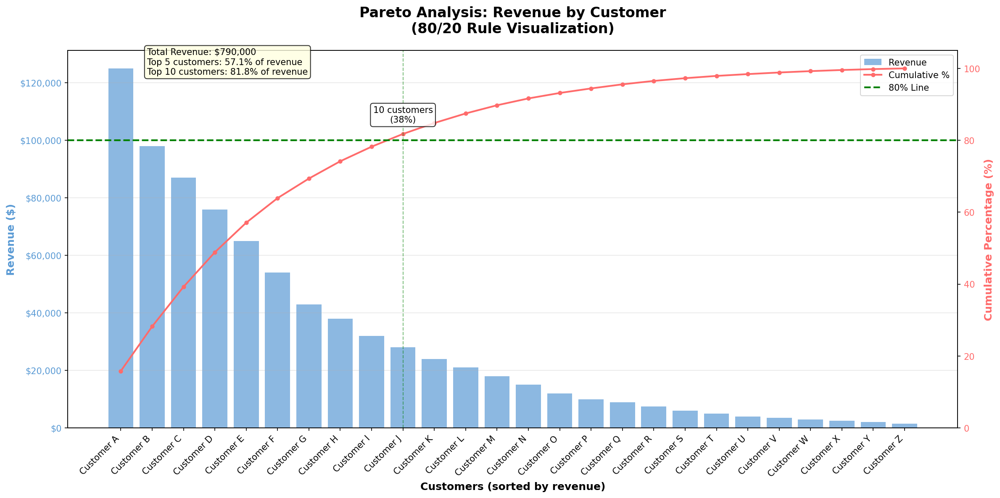

# Tableau Pareto Analysis - Revenue by Customer

## Overview

This repository contains a complete Pareto Analysis implementation for analyzing Revenue by Customer using Tableau. The Pareto principle (also known as the 80/20 rule) helps identify which customers contribute the most to your revenue, enabling better business decisions and resource allocation.

## What is Pareto Analysis?

Pareto Analysis is a decision-making technique that statistically separates a limited number of input factors as having the greatest impact on an outcome. In business, it often reveals that approximately 80% of revenue comes from 20% of customers. This analysis helps:

- Identify your most valuable customers
- Focus sales and marketing efforts effectively
- Optimize resource allocation
- Understand revenue concentration and risk

## Repository Contents

- **customer_revenue_data.csv** - Sample dataset containing customer names and their revenue contributions
- **pareto_analysis.twb** - Tableau workbook with pre-built Pareto analysis visualization
- **pareto_analysis_chart.png** - Example visualization showing the Pareto analysis output

## Example Visualization



The chart above demonstrates the Pareto principle with the sample data, showing how 10 customers (38% of the customer base) generate approximately 82% of the total revenue.

## Dataset Structure

The sample dataset includes:
- **Customer**: Customer names (Customer A through Customer Z)
- **Revenue**: Revenue amount in dollars for each customer

The dataset contains 26 customers with revenues ranging from $1,500 to $125,000, providing a realistic distribution for Pareto analysis.

## How to Use

### Prerequisites
- Tableau Desktop (version 2023.4 or later recommended)
- Basic understanding of Tableau interface

### Opening the Workbook

1. Clone or download this repository
2. Open Tableau Desktop
3. Open the `pareto_analysis.twb` file
4. The workbook will automatically look for `customer_revenue_data.csv` in the same directory

### Understanding the Visualization

The Pareto Analysis worksheet includes:

1. **Bar Chart**: Shows individual customer revenue (sorted from highest to lowest)
2. **Cumulative Revenue**: Running sum of revenue across customers
3. **Cumulative Percentage**: Percentage of total revenue accumulated
4. **80/20 Reference Line**: Visual indicator showing which customers contribute to 80% of revenue

### Key Calculated Fields

The workbook uses these calculated fields:

1. **Cumulative Revenue**:
   ```
   RUNNING_SUM(SUM([Revenue]))
   ```

2. **Cumulative Percentage**:
   ```
   RUNNING_SUM(SUM([Revenue])) / TOTAL(SUM([Revenue]))
   ```

These calculations enable the running total that creates the characteristic Pareto curve.

## Customizing for Your Data

To use your own data:

1. **Prepare Your Data**: Create a CSV file with two columns:
   - Column 1: Customer/Product/Category name
   - Column 2: Revenue or quantity value

2. **Update Data Source**:
   - In Tableau, go to Data > Edit Data Source
   - Browse to your CSV file
   - Ensure field names match (Customer, Revenue) or update the calculations

3. **Refresh the View**: Tableau will automatically update the visualization

## Insights from Sample Data

From the included sample dataset:
- Top 5 customers (19% of customers) generate approximately 48% of total revenue
- Top 10 customers (38% of customers) generate approximately 73% of total revenue
- This demonstrates the classic Pareto principle in action

## Business Applications

Use this analysis to:

1. **Customer Segmentation**: Identify VIP customers for special treatment
2. **Risk Management**: Understand revenue concentration
3. **Sales Strategy**: Focus resources on high-value customer acquisition
4. **Account Management**: Prioritize customer relationship management efforts
5. **Product Analysis**: Apply the same analysis to products or services

## Technical Details

### Workbook Configuration
- Data Source: Text file (CSV)
- Encoding: UTF-8
- Separator: Comma (,)
- Header Row: Yes
- Data Types: String (Customer), Integer (Revenue)

### Visualization Features
- Automatic sorting by revenue (descending)
- Color coding by customer
- Interactive tooltips showing cumulative metrics
- Responsive design for various screen sizes

## Troubleshooting

**Problem**: Workbook can't find the data file
- **Solution**: Ensure `customer_revenue_data.csv` is in the same directory as the `.twb` file

**Problem**: Calculations not showing correctly
- **Solution**: Verify that the Revenue field is set to "Measure" and aggregated as SUM

**Problem**: Chart doesn't sort correctly
- **Solution**: Right-click on the Customer axis and select Sort > Field > Revenue > Descending

## Additional Resources

- [Tableau Documentation](https://help.tableau.com/)
- [Pareto Principle on Wikipedia](https://en.wikipedia.org/wiki/Pareto_principle)
- [Tableau Community Forums](https://community.tableau.com/)

## License

This project is provided as-is for educational and analytical purposes.

## Contributing

Feel free to fork this repository and submit pull requests with improvements or additional examples.

## Version History

- **v1.0** - Initial release with sample data and basic Pareto analysis visualization

---

For questions or feedback, please open an issue in this repository.